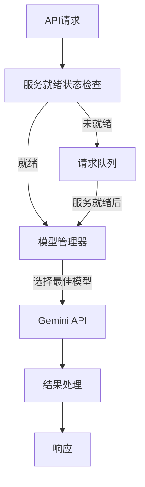

# Verit AI 辟谣助手 - 后端服务

## 项目简介
Verit AI 辟谣助手是一个基于 Google Gemini API 的智能事实核查系统。本仓库包含后端服务实现，提供 RESTful API 接口，支持 Web 端和 Chrome 扩展两种接入方式。

## 核心功能
- 多维度内容分析：事实性、客观性、可靠性、偏见性评估
- 智能模型调度：支持 Gemini 2.0/1.5 模型动态切换
- 分布式缓存：支持本地缓存和 Redis 分布式缓存
- 实时监控：服务健康状态、性能指标监控
- 优雅降级：完善的错误处理和重试机制

## 系统架构


## 快速开始

### 环境要求
- Node.js >= 14.x
- npm >= 6.x
- Redis (可选，用于分布式缓存)

### 安装步骤
1. 克隆仓库
```bash
git clone https://github.com/your-org/oracle-ai-factchecker.git
cd oracle-ai-factchecker/backend
```

2. 安装依赖
```bash
npm install
```

3. 配置环境变量
```bash
cp .env.example .env
# 编辑 .env 文件，填入必要的配置信息
```

4. 启动服务
```bash
# 开发环境
npm run dev

# 生产环境
npm run start
```

## API 文档

### 主要接口

#### 1. 内容分析接口
```typescript
POST /api/v1/analyze
Content-Type: application/json

Request:
{
  "content": string,    // 待分析内容
  "url": string,       // 内容来源URL
  "lang": string       // 语言代码（默认zh）
}

Response:
{
  "status": "success" | "error",
  "data": {
    "score": number,           // 0-100
    "flags": {
      "factuality": "高" | "中" | "低",
      "objectivity": "高" | "中" | "低",
      "reliability": "高" | "中" | "低",
      "bias": "高" | "中" | "低"
    },
    "source_verification": {
      "sources_found": string[],
      "credibility_scores": number[],
      "overall_source_credibility": string
    },
    "entity_verification": {
      "entities_found": string[],
      "accuracy_assessment": string,
      "corrections": string[]
    },
    "fact_check": {
      "claims_identified": string[],
      "verification_results": string[],
      "overall_factual_accuracy": string
    },
    "exaggeration_check": {
      "exaggerations_found": string[],
      "corrections": string[],
      "severity_assessment": string
    },
    "summary": string,
    "sources": Array<{
      "title": string,
      "url": string
    }>
  }
}
```

#### 2. 健康检查接口
```typescript
GET /api/health

Response:
{
  "status": "OK" | "ERROR" | "INITIALIZING",
  "ready": boolean,
  "currentModel": string,
  "groundingEnabled": boolean,
  "timestamp": string,
  "quotaStatus": {
    "groundingRemaining": number,
    "resetTime": string
  }
}
```

### 错误处理
```typescript
{
  "status": "error",
  "error": {
    "code": string,
    "message": string,
    "details": string
  }
}
```

## 配置说明

### 环境变量
```yaml
必需变量:
  - GEMINI_API_KEY: Google API密钥
  - NODE_ENV: 运行环境(development/production)
  - PORT: 服务端口
  - DAILY_GROUNDING_LIMIT: 每日Grounding限额(默认500)

可选变量:
  - REDIS_URL: Redis连接URL
  - LOG_LEVEL: 日志级别
  - CACHE_TTL: 缓存有效期(秒)
```

### 模型配置
```yaml
可用模型:
  - gemini-2.0-flash:
      特点: 高级推理 + Google Search Grounding
      使用场景: 默认模型，需要外部验证时
      配额限制: 每日500次Grounding调用
  - gemini-1.5-flash:
      特点: 基础推理能力
      使用场景: 备选模型，无需外部验证时
      配额限制: 无

调度策略:
  优先级:
    1. gemini-2.0-flash + Grounding
    2. gemini-2.0-flash (无Grounding)
    3. gemini-1.5-flash
```

## 性能优化

### 缓存策略
```yaml
缓存机制:
  存储位置: backend/cache/
  缓存内容:
    - 分析结果: 7天有效期
    - 模型状态: 24小时更新
    - 配额计数: 每日重置
  
  清理策略:
    - 定时清理过期缓存
    - 超出容量时LRU淘汰
```

### 请求处理优化
```javascript
const OPTIMIZATION_CONFIG = {
  // 并发控制
  MAX_CONCURRENT_REQUESTS: 5,
  REQUEST_TIMEOUT: 30000,
  
  // 队列管理
  MAX_QUEUE_SIZE: 100,
  QUEUE_TIMEOUT: 60000,
  
  // Token估算
  CHAR_TO_TOKEN_RATIO: 4,
  MAX_INPUT_LENGTH: 30000,
  
  // 缓存设置
  CACHE_TTL: 7 * 24 * 60 * 60, // 7天
  MAX_CACHE_ITEMS: 1000
};
```

## 监控与告警

### 性能指标
```yaml
监控指标:
  - API响应时间
  - 请求成功率
  - 模型切换频率
  - Grounding使用量
  - 缓存命中率

告警阈值:
  - 响应时间 > 10s
  - 成功率 < 95%
  - 连续失败 > 3次
  - Grounding剩余量 < 50次
```

## 开发指南

### 项目结构
```
backend/
├── src/
│   ├── api/          # API路由和控制器
│   ├── config/       # 配置文件
│   ├── models/       # 数据模型
│   ├── services/     # 业务逻辑
│   ├── utils/        # 工具函数
│   └── app.js        # 应用入口
├── tests/            # 测试文件
├── .env.example      # 环境变量示例
├── package.json      # 项目依赖
└── README.md         # 项目文档
```

### 开发流程
1. Fork 项目
2. 创建特性分支
3. 提交变更
4. 发起 Pull Request

### 测试
```bash
# 运行单元测试
npm run test

# 运行集成测试
npm run test:integration

# 运行所有测试并生成覆盖率报告
npm run test:coverage
```

## 部署指南

### Docker部署
```bash
# 构建镜像
docker build -t oracle-ai-factchecker .

# 运行容器
docker run -p 3000:3000 \
  -e GEMINI_API_KEY=your_api_key \
  -e NODE_ENV=production \
  oracle-ai-factchecker
```

### 传统部署
```bash
# 安装依赖
npm install --production

# 启动服务
npm run start
```

## 贡献指南
1. 遵循代码规范
2. 编写单元测试
3. 更新文档
4. 提交 Pull Request

## 许可证
MIT License