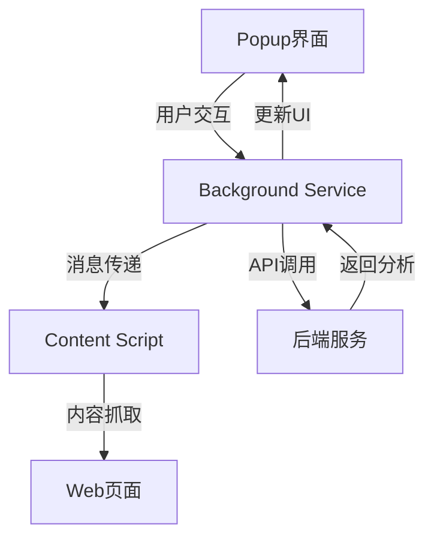
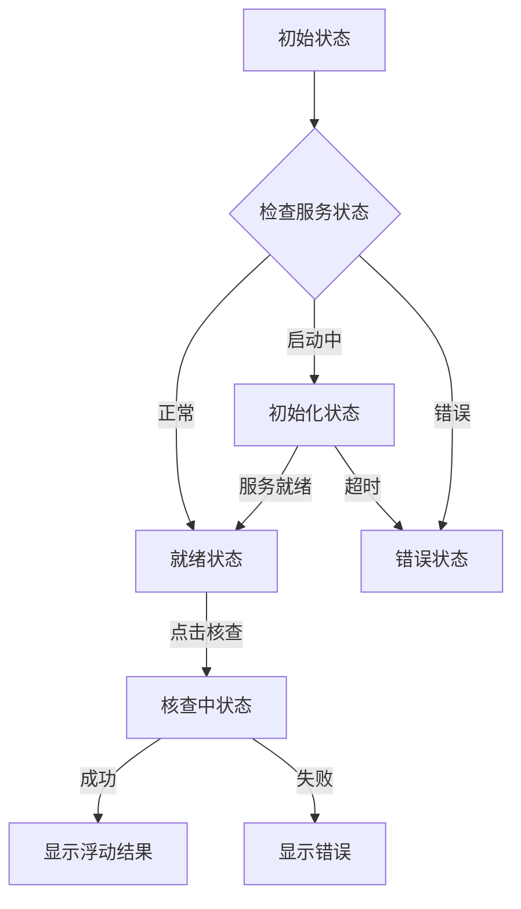

# Oracle AI 辟谣助手 Chrome扩展 - PRD v1.1

## 项目概述
Oracle AI 辟谣助手的Chrome扩展组件，为用户提供便捷的网页内容真实性验证服务。通过集成Google Gemini AI，实现一键式内容核查功能。

## 系统架构


## 核心功能模块

### 1. Background Service Worker
主要职责：
- 标签页状态管理
- 内容分析请求处理
- 缓存管理
- 与Content Script通信
- 徽章状态更新

```typescript
interface ServiceState {
  isAnalyzing: boolean;
  lastError: string | null;
  currentTabId: number | null;
  serviceReady: boolean;
}

interface ExtensionStateManager {
  state: ServiceState;
  reset(): void;
  persistState(): Promise<void>;
  loadState(): Promise<void>;
  updateState(update: Partial<ServiceState>): Promise<void>;
}
```

### 2. Content Script
主要职责：
- 页面内容提取
- 文本清洗
- 与Background通信

```typescript
interface ContentExtractor {
  getMainContent(): string;
  cleanText(text: string): string;
  extractMetadata(): PageMetadata;
}

interface PageMetadata {
  title: string;
  url: string;
  timestamp: string;
  author?: string;
}
```

### 3. Popup界面
主要职责：
- 显示服务状态
- 提供核查入口
- 显示项目信息
- 提供反馈渠道
- 错误状态显示

```typescript
// Popup 状态定义
interface PopupState {
  serviceStatus: 'ready' | 'initializing' | 'error';
  isAnalyzing: boolean;
  lastError: string | null;
}

// Popup UI组件
interface PopupUIComponents {
  statusIndicator: HTMLElement;    // 服务状态指示器
  analyzeButton: HTMLElement;      // 核查按钮
  feedbackButton: HTMLElement;     // 反馈按钮
  loadingIndicator: HTMLElement;   // 加载指示器
  errorDisplay: HTMLElement;       // 错误显示
}
```

## 状态管理

### 1. 扩展状态
```typescript
interface ExtensionState {
  isAnalyzing: boolean;
  lastError: string | null;
  currentTabId: number | null;
  serviceReady: boolean;
}
```

### 2. 分析结果状态
```typescript
interface AnalysisResult {
  score: number;          // 0-100
  flags: {
    factuality: '高' | '中' | '低';
    objectivity: '高' | '中' | '低';
    reliability: '高' | '中' | '低';
    bias: '高' | '中' | '低';
  };
  summary: string;
  sources: Array<{
    title: string;
    url: string;
  }>;
}
```

## 用户界面设计

### 1. Popup窗口布局
```html
<div class="popup-container">
  <!-- 头部区域 -->
  <header class="popup-header">
    
    <h1>Verit.ai Fact Checker</h1>
  </header>
  
  <!-- 服务状态区域 -->
  <div class="service-status">
    <div class="status-indicator" id="statusIndicator">
      <span class="status-icon"></span>
      <span class="status-text" data-i18n="serviceStatus">服务状态: 正常</span>
    </div>
  </div>
  
  <!-- 操作区域 -->
  <div class="action-section">
    <button id="analyzeButton" class="primary-button" data-i18n="analyze">
      开始核查
    </button>
    <div class="loading-indicator hidden" id="loadingIndicator">
      <span class="spinner"></span>
      <span data-i18n="analyzing">核查中...</span>
    </div>
  </div>
  
  <!-- 项目信息区域 -->
  <div class="info-section">
    <p class="info-text" data-i18n="description">
      Verit.ai 使用先进的 AI 技术帮助您快速核实网页内容的可信度。
    </p>
  </div>
  
  <!-- 反馈区域 -->
  <footer class="popup-footer">
    <a href="https://forms.gle/yourFeedbackForm" 
       target="_blank" 
       class="feedback-button" 
       data-i18n="feedback">
      提供反馈
    </a>
  </footer>
</div>
```

### 2. 样式指南
```css
/* 状态颜色 */
:root {
  --status-ready: #4CAF50;
  --status-initializing: #FFC107;
  --status-error: #F44336;
  --button-primary: #2196F3;
  --button-hover: #1976D2;
  --button-disabled: #BDBDBD;
}

/* 弹窗尺寸 */
.popup-container {
  width: 320px;
  min-height: 200px;
  padding: 16px;
}

/* 响应式调整 */
@media (max-width: 360px) {
  .popup-container {
    width: 280px;
  }
}
```

## 错误处理

### 1. 错误类型
```typescript
enum ErrorType {
  CONTENT_ERROR = '内容获取失败',
  API_ERROR = 'API调用失败',
  PARSE_ERROR = '解析结果失败',
  RENDER_ERROR = '显示结果失败'
}

interface ErrorResponse {
  type: ErrorType;
  message: string;
  details?: string;
}
```

### 2. 错误处理流程
```typescript
async function handleError(error: ErrorResponse, tabId: number) {
  console.error('Error:', error);
  
  await ExtensionStateManager.updateState({
    isAnalyzing: false,
    lastError: error.message
  });
  
  updateErrorDisplay(error);
}
```

## 配置文件

### 1. manifest.json
```json
{
  "manifest_version": 3,
  "name": "Oracle AI Fact Checker",
  "version": "1.0.0",
  "description": "使用 Google Gemini AI 进行网页内容事实核查",
  "permissions": [
    "activeTab",
    "storage"
  ],
  "host_permissions": ["<all_urls>"],
  "action": {
    "default_popup": "popup.html",
    "default_icon": {
      "16": "icons/icon16.svg",
      "48": "icons/icon48.svg",
      "128": "icons/icon128.svg"
    }
  },
  "background": {
    "service_worker": "background.js",
    "type": "module"
  },
  "content_scripts": [
    {
      "matches": ["<all_urls>"],
      "js": ["content.js"]
    }
  ]
}
```

## 性能优化

### 1. 缓存策略
- 分析结果缓存：7天
- 页面内容哈希缓存：24小时
- 配额计数缓存：每日重置

### 2. 资源管理
- 懒加载非关键资源
- 使用Service Worker缓存静态资源
- 优化图标资源大小

## 安全考虑

### 1. 数据安全
- 本地存储加密
- 敏感信息脱敏
- API密钥保护

### 2. 通信安全
- HTTPS请求
- 消息验证
- CSP策略

## 部署流程

### 1. 开发环境
```bash
# 安装依赖
npm install

# 开发构建
npm run watch

# 生产构建
npm run build
```

### 2. 发布清单
1. manifest.json
2. 构建后的JS文件
   - background.js
   - content.js
   - popup.js
3. HTML/CSS文件
   - popup.html
   - styles.css
4. 图标资源
   - icons/*.svg
5. 依赖库（如需要）

## 监控指标

### 1. 性能指标
- API响应时间
- 内容分析耗时
- UI渲染时间
- 内存使用情况

### 2. 用户指标
- 分析成功率
- 错误发生率
- 用户使用频率
- 功能使用分布

## 更新计划

### 1.0版本
- [x] 基础分析功能
- [x] 结果展示界面
- [x] 错误处理机制
- [x] 状态管理系统

### 1.1版本规划
- [ ] 批量分析功能
- [ ] 分析历史记录
- [ ] 自定义分析规则
- [ ] 离线分析支持 

### 工作流程

#### 1. 初始化流程
```typescript
interface PopupInitializer {
  // 初始化UI组件
  initializeUI(): void;
  
  // 检查服务状态
  checkServiceStatus(): Promise<void>;
  
  // 设置事件监听器
  setupEventListeners(): void;
  
  // 加载多语言支持
  initializeI18n(): void;
}
```

#### 2. 状态转换


#### 3. 用户交互流程
1. **初始加载**
   - 检查服务状态
   - 更新状态指示器
   - 启用/禁用核查按钮

2. **核查操作**
   - 点击核查按钮
   - 显示加载状态
   - 发送核查请求
   - 等待结果响应

3. **结果处理**
   - 成功：关闭popup，显示浮动结果
   - 失败：显示错误信息，允许重试

### 错误处理

#### 1. 错误类型
```typescript
enum PopupErrorType {
  SERVICE_UNAVAILABLE = '服务暂时不可用',
  INITIALIZATION_TIMEOUT = '服务初始化超时',
  ANALYSIS_FAILED = '内容分析失败',
  NETWORK_ERROR = '网络连接错误'
}
```

#### 2. 错误显示
```typescript
interface ErrorDisplay {
  showError(type: PopupErrorType, details?: string): void;
  clearError(): void;
  updateServiceStatus(status: ServiceStatus): void;
}
```

### 多语言支持

#### 1. 语言资源
```typescript
interface I18nResources {
  zh: {
    serviceStatus: {
      ready: '服务状态: 正常',
      initializing: '服务正在启动中...',
      error: '服务异常'
    },
    buttons: {
      analyze: '开始核查',
      analyzing: '核查中...',
      feedback: '提供反馈'
    },
    errors: {
      // 错误信息
    }
  },
  en: {
    serviceStatus: {
      ready: 'Service Status: Ready',
      initializing: 'Service Starting...',
      error: 'Service Error'
    },
    buttons: {
      analyze: 'Analyze',
      analyzing: 'Analyzing...',
      feedback: 'Feedback'
    },
    errors: {
      // error messages
    }
  }
}
```

### 性能优化

1. **状态检查优化**
   - 使用节流控制状态检查频率
   - 缓存服务状态检查结果

2. **资源加载优化**
   - 延迟加载非关键资源
   - 预加载核心组件

3. **交互响应优化**
   - 使用过渡动画提供视觉反馈
   - 防抖处理用户操作 